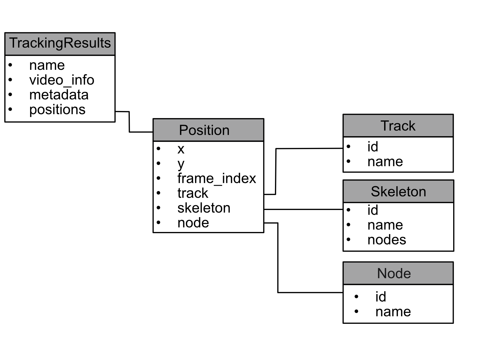

# NIXtrack mapping specification

This document describes how (video) tracking results are represented using the [NIX](https://github.com/g-node/nix) entities.

The basic concept of the is shown in the UML diagram.

The **TrackingResults** are defined by a name, the information about the source video file, additional metadata, e.g. about the tracking tool, etc. and of course the positions of entities found in the video frames. These are the **positions**. Each **Position** is defined by the **x** and **y** coordinates, and the **frame_index** in the video.

Sa far, the mapping defines only the essential parts.

## NIX types

All types are prefixed by ``nix.tracking``. That is, for example frame indices are stored applying the type ``nix.tracking.instance_frameidx``.

|type              | Definition| NIX specification|
|------------------|-----------|--------------|
| results          | The Tag to bind frame indices to all other information | MultiTag, positions: frame_indices, references all other info|
|instance_frameidx | The indices in the original video in which the instance is found| 1D DataArray, dtype: int64, dimensions: [RangeDimension linked to self] |
|instance_skeleton | The skeleton of nodes assigned to the instance | 1D DataArray, dtype: int64, dimensions: [RangeDimension linked to frame indices]|
|instance_position| The position of the found instance| 3D DataArray, dtype: float, dimensions:[RangeDimension linked to frame indices, SetDimension {x, y}, SetDimension {node names}] |
|centroid_position| The centroid position.| 2D DataArray dtype: float, dimensions: [RangeDimension linked to frame indices, SetDimension {x, y}]|
|instance_track| The track to which the instances are assigned| 1D DataArray, dtype: float, dimensions: [RangeDimension linked to frame indices.]|
|nodes_score| The score/quality assigned to the nodes| 2D DataArray dtype: float dimensions: [RangeDimension linked to frame indices, SetDimension {node names}]|
|instance_score| The score/quality assigned to the instance| 1D DataArray dtype: float, dimensions: [RangeDimension linked to frame indices]|
|nodes_score| The score/quality assigned to the nodes| 2D DataArray dtype: float dimensions: [RangeDimension linked to frame indices, SetDimension {node names}]|
|skeleton_map | Maps node names to integer values | DataFrame, columns: [name, index] |
|track_map | Maps track names to integer values | DataFrame, columns: [name, index] |

## Mapping sleap to nix.tracking

So far, a nixtrack file represents the results of individual recorded videos.

| sleap entity    | attribute   |      maps to     |  mapped via           |
|-----------------|-------------|------------------|-----------------------|
| TrackingAnalysis|             | nix file         |                       |
|                 | name        | nix.Block.name   |                       |
|                 | video_info  | nix.Section      | block.source.metadata |
|                 | metadata    | nix.Section      | block.metadata        |
|                 | positions   | nix.DataArray    | block.data_arrays     |
|Frame indices    |             | nix.DataArray    | block.data_arrays     |
|Instances        |             | nix.DataArray    | block.data_arrays["position"]|
|Instance scores  |             | nix.DataArray    | block.data_arrays["instance score"]|
|Node scores      |             | nix.DataArray    | block.data_arrays["node score"]|
|Node names       |             | nix.SetDimension | block.data_arrays["node score"].dimensions[-1].labels|
|Tracks           |             | nix.DataArray    | block.data_arrays["track"]|
|centroid | | nix.DataArray| block.data_arrays["centroid"]| 

## TODOs

* Add Edges to skeletons.
* Scorer information.
